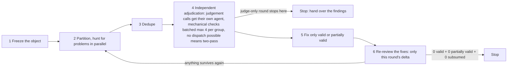

# Closed-loop adversarial review

**The one core discipline**: the context that finds a problem must never be the context that decides whether it is real.

## 1. When to use it

Don't look at what kind of object it is. Look at whether it has these three traits. All three have to hold:

1. **You cannot tell whether it is right by looking at the object alone.** You have to hold it up against a standard before you know how well it was done.
2. **That standard can be settled before review starts.** It may already exist — a specification, a team convention, a higher-level document, a source of fact you can go and check. It may also not exist yet, as long as you settle it before you start, or the user hands it to you on the spot. What matters is that it is **settled before review begins**: change the standard halfway through and every verdict you already gave stops counting. (If you find the standard itself is ambiguous, ask about it once, per §9 — don't quietly rewrite it.) If you cannot settle it, this process turns into everyone arguing for their own opinion. Don't use it.
3. **Missing a real problem is far worse than reporting a false one.** Independent adjudication costs extra, and "missing one hurts more than a false alarm" is exactly what makes that cost worth paying. When the two costs are about equal, checking the thing yourself is enough. (If the user explicitly asks for an independent review, this trait counts as satisfied — they have already made that call for you.)

When all three hold, the object can be anything: a batch of changes, a proposal, a migration plan, an audit, a release checklist, a piece of research, a contract, a decision record that has already been signed off.

It also applies when the user says "review this carefully" or "re-review after fixing". That sentence on its own satisfies the third trait (they asked for it explicitly). But if the first two don't hold — the object's correctness is plain on its own, or you cannot settle the standard — leave it alone for now, and in the second case settle the standard with the user first.

## 2. Why it has to be a loop

These three numbers explain why the process is shaped the way it is, and why none of its steps can be skipped:

1. **Fixes introduce new problems of their own**: in measured runs, **16 of 51 fixes** introduced something new, or fixed one place and missed another — which is why, in a full round, every batch of fixes has to go back through review.
2. **Adjudication overturns a substantial share of findings**: roughly **1 in 5 to 1 in 3** findings ends up invalid, downgraded, or re-described because it was really a symptom of something larger. What this step saves is not time; it is a batch of pointless edits.
3. **It converges**: on a real project, the number of new problems each round found inside the previous round's fixes went **8 → 3 → 3 → 2 → 0**. The process is heavy, but it is not endless.

The worst defects are usually not the ones you find by walking a checklist. They are the ones an adjudicator pulls out by asking a question nobody else asked: "this edit — which path that should have changed alongside it did it miss?"

## 3. The shape of the loop



Before each round starts, **first confirm the object in your hands is identical to the frozen copy**; if it isn't, freeze it again and go back to step 1. Short of that, every round goes back to step 2, never to step 1.

### The two modes

**Full round** — steps 1 to 6, what the diagram draws. Use it when this process owns the fix, that is, when nothing else is going to act on the findings.

**Judge-only round** — steps 1 to 4, then stop. Nothing is fixed and there is no re-review inside the round. What the round produces is **the list of problems that survived adjudication**, and what happens to that list is somebody else's job. Use it when this round is a gate inside a larger process that owns the fix and the re-entry: that process fixes, then runs this round again on the new state, so convergence is measured across those rounds rather than inside one. The "0 valid + 0 partially valid + 0 subsumed" rule in §8 is not this mode's exit condition — producing the finding list is.

This is not the cheap mode. Steps 1 to 4 are the expensive part; what it drops is the half that was about to be done twice anyway.

## 4. Before you start: find out what this machine can actually do

First check your tool list for the ability to hand a task to another independent context. That is what decides how this round is orchestrated; the five-question self-check is in [`harness-probe.md`](./references/harness-probe.md).

Can you dispatch subagents, can those subagents dispatch further (that is, is there nesting), and can you dispatch several in parallel at once → by default hand the whole round to a single orchestrator ([`orchestration.md`](./references/orchestration.md) mode A; this is the key switch for controlling the cost of your main context). Can you dispatch, but not nest, or not run in parallel → use mode B, where the lead agent orchestrates (mode selection is at the end of [`harness-probe.md`](./references/harness-probe.md); what running it yourself costs is in [`orchestration.md`](./references/orchestration.md)). Can you not dispatch at all → use the two-pass method, and state plainly in the report that "this round had no independent-context adjudication".

### Preconditions

- You have settled the standard from trait 2 of §1.
- The object can be retrieved, can be stored, can be compared before and after a change, and can be rolled back if needed.

## 5. Freeze the object under review

Two things need freezing: **one unified body of material for reviewers to read**, and **one fingerprint you can compare against repeatedly**. This has nothing to do with whether you use version control. Freezing those two takes four steps:

1. **The copy has to live somewhere subagents can read it**: by default a scratch directory inside the working tree (most harnesses only let subagents read inside the working tree, and a headless session usually has no permission prompt to click — if it can't read it, it can't read it). The dispatch prompt must give an **absolute path**. Under version control it will show up as untracked; keep it out of the way by adding it to the repository's local exclude file (get its path with `git rev-parse --git-path info/exclude`) — note that this is a persistent change to local configuration. With no version control, just put it somewhere nothing else reads.
2. **Record the content fingerprint, how to retrieve it, and this round's baseline** (byte count / digest / retrieval command) — the fingerprint proves **this copy has not been changed from outside since the moment it was frozen**. The object changing because of this round's own fixes is normal and does not count as "changed from outside"; when that happens, freeze it again per §3 and record a new fingerprint (save this round's fix delta first). This copy is itself the baseline for comparing across rounds. Where version control exists, you may separately record an identifier for a working-tree snapshot (for example the output of `git stash create`) as a backup.
3. **Record what you intend to change this round.** With version control, `git status --porcelain` lists it. Without it, hash every file before you start and again after you finish; comparing the two tells you what actually moved. Check that against your plan and confirm you touched nothing outside it. If you can do neither, write clearly in the report that "this part rests on self-report plus manual checking" — do not write it as though you had confirmed it.
4. **Prepare the unified material**: if there is a delta, give the delta (with version control, use the kind that includes staged changes; for newly added files run `git add -N` first — a bare `git diff` shows neither staged changes nor new files; if you cannot produce a delta, give full copies of those files instead). If there is no delta, give full copies.

Alongside that, write these three things out **item by item**, and put them into **every finder's task verbatim**:

1. **What the object is**: what this material is, and why it was done this way.
2. **The acceptance criteria**: write down what this review is judging against. If it is an existing specification, convention, or higher-level document, name which one. If it was settled on the spot, write the text of those criteria here.
3. **The intentional-omissions list** (required; write "none" if there is nothing on it; the common categories are below — add or drop them to suit the object). **Without this list, reviewers will report the things you deliberately left alone as defects** — that is the number one source of noise, and it buries the real findings:
   - Scope or level of detail already declared out of bounds: not doing X / Y / Z this round — must not be reported as an omission; the only reportable thing here is whether the consequences of not doing it were spelled out.
   - Implementation details deliberately left unwritten — must not be reported as defects.
   - Alternatives that were considered and rejected (the counter-argument for them) — these are not leftovers.
   - Existing terminology carried over — this is not a wording problem.
   - Items already adjudicated and settled in a previous round — only "not actually fixed / fixed in the wrong direction / introduced a new problem" counts as a finding this round.

## 6. How many blocks, and when not to bother at all

Don't go straight to maximum process, and don't always split into many blocks. **How many blocks you use is decided by three properties of the object**: how many mutually non-overlapping pieces it cuts into, how much uncertainty there is, and how high the cost of a miss is. **The table below is a starting point, not something to look things up in**; for combinations it doesn't cover, work it out yourself the same way. As a rule, don't go past 6 blocks — beyond that you get fewer and fewer new findings, while every dispatch still costs a fixed overhead. If the object genuinely splits into a dozen independent modules and you have to add more, then add more, but know that you are paying that overhead. One more rule to keep is the partitioning principle in §7. And if the cost of a miss is irreversible, or touches an external commitment, run the full process no matter how few blocks it would cut into.

| How many non-overlapping pieces the object cuts into | Uncertainty / cost of a miss (whichever is higher) | Starting point |
|---|---|---|
| 1 piece, or right and wrong are plain at a glance | Low / about the same as a false alarm | Usually not worth this process — checking it yourself is enough. But an explicit request from the user overrides this row: it settles trait 3 on its own, so run the process whenever traits 1 and 2 hold |
| 2–4 | Low | 1–2 blocks; adjudication may be batched (max 4 per group), no requirement for multiple fix-and-re-review rounds |
| 5–8 | Medium | 2–3 blocks; coarser is better than incomplete |
| >8, or the pieces need to be read against each other | Medium-high / High | 4–6 blocks; the standard approach |

**When in doubt, cut one more block** — dispatching one or two extra agents costs far less than missing a problem.

## 7. How to partition, and how to dispatch

The partitioning and dispatch criteria in this section **hold for any multi-subagent task, not just review** (parallel research, bulk checking, and so on).

Tasks at the same level go out all at once, with no overlap between them. Tasks at the same level have no dependencies on each other, so they **must go out as one parallel batch** (sending one, waiting for it, then sending the next is wrong); things only need to be serial when what the next round looks like depends on how this one came back. Every block's task is **read-only**.

**Why batch whenever you can — here is the arithmetic**: every dispatch carries a fixed overhead that has nothing to do with the task's content (system prompt, tool definitions, skill list — on the order of a few thousand tokens). Dispatching N times costs roughly N × that fixed overhead, plus all the content. **Batching is what saves you that overhead**, and as long as it doesn't break independence, it doesn't cost you correctness. Conversely, doubling the number of blocks roughly doubles the cost, while the new findings get thinner and thinner.

**Every block's task has to carry these**:

1. A `<critical>`-level hard constraint: **read-only** — don't modify the object, don't commit, don't run the full test suite or lint. Apart from writing its own artifact into the scratch directory you designate (see §5), it must not touch any other file in the working tree.
2. What the object is + the acceptance criteria (spelling out what it is being judged against) + the intentional-omissions list.
3. Every finding has to give: an identifier / **location** (where it sits in the object — line number, section number, item number, whichever suits the object) / **verbatim excerpt** / why this is a problem / **severity** / **minimal fix** / confidence. No empty phrases like "consider improving consistency".
4. A fixed-format table: `# | Location | Severity | Excerpt | Problem | Minimal fix | Confidence` (severity means **how big the impact is**; name the three tiers yourself to suit the object, for example "must fix / should fix / optional" — when the object is a release artifact, the top tier is "blocks release"). This is a different thing from the four verdict tiers in §8; don't mix them up. Follow the table with an "items that could not be judged" section. **"No problems at all" is an allowed conclusion.**

### Partitioning principles

The blocks **must not overlap, and together they must cover everything**. **When there are 2 or more blocks, exactly one of them is cross-cutting** (its job is to go after leftovers, check whether references still resolve, and verify claims like "this has no impact").

What you cut along, and what unit you count in, is yours to decide based on the object — files are just one unit, for when the object happens to be a pile of files.

### Deciding whether a finding is dispatched on its own or batched (ask three questions first; a "yes" to any one of them means dispatch it alone)

| What you're judging | The question to ask | If "yes" |
|---|---|---|
| **Does it take judgement?** | To decide this one, do you have to understand a semantic conflict, check whether it is self-consistent, decide whether it is really a problem, decide whether it will cause ambiguity, or weigh a trade-off? Or is it enough to just check a fact (is this really what that line says, does that reference still resolve, is the count right, is anything missing from the list)? | **Dispatch it to an agent of its own**, using an executor that is good at judgement |
| **What does getting it wrong cost?** | Would this verdict change behaviour, a contract, an external commitment, or the meaning of a process — or cause something irreversible? | **Dispatch it alone** |
| **Is it an old debt?** | Is this something a previous round already rejected or downgraded, now being raised again? | **Dispatch it alone** |
| None of the three | — | **Batch it by category, max 4 per group**, using an executor that only does mechanical checking |

**When in doubt, dispatch it alone.** Fifteen findings all dispatched separately means fifteen fixed overheads, when only 3–5 of them actually needed judgement.

Whether a finding can be batched with others **depends on what has to be done to judge it, not on which block it came from**: anything that requires reasoning across several sources at once (conflicting conventions, self-consistency, whether it is really a problem) always goes out alone, never in a batch. If there are too many items, split them by count, still max 4 per group.

### Rules that must hold when batching (break them and batching bends the judgement instead)

Judging several items one after another in the same context means each one gets coloured by the one before it. So fence each of them off:

1. **Every item in the group gets its own verdict**: each one needs evidence / re-description / minimal fix / counter-evidence. **"Same as above" and "this whole category looks fine" are not allowed.**
2. The task must say explicitly: **when judging one item, do not let the others in the group influence you**. The output order is fixed: **finish every verdict first, then write the group summary** — never the other way round.
3. A group **must not contain two findings about the same place** (dedupe those into one first). And **shuffle the order of the items** — don't put same-category items with the same conclusion next to each other (adjacent placement invites copying one answer down the list).
4. **Batching does not lower the bar**: every item judged in a batch carries **exactly the same** evidentiary requirements as one dispatched alone. "I'm judging several at once anyway" is never a reason to drop the evidence, the re-description, or the counter-evidence.
5. **Spot check**: if a group comes back saying "all valid, and not one of them was narrowed", pick the highest-risk item in that group and send it through adjudication again, alone.

### How many dispatches, and which kind of executor

**Dispatches ≈ the finders (one per block) + the adjudicators (items sent alone + ⌈batched items / 4⌉ + groups that triggered a spot check)**.

Look at **the adjudication half**: if it clearly exceeds **block count × 2**, don't rush to dispatch. Go back and check two things first — are there duplicate findings that should have been merged? Have some items been filed as "takes judgement" when they are really mechanical checks? Once you have checked both and there genuinely is nothing left to cut (every group is already sliced to the max 4, everything mergeable is merged), then **dispatch the number you computed**: **this reference line exists to catch adjudications that didn't need to happen, it is not a hard ceiling.** What you are trying to push down is the count of items that "must go out alone", not the number of blocks — cut the blocks and this reference line shrinks with them.

Mechanical checking goes to an executor that only checks; work that takes judgement goes to an executor that is good at it — **get that the wrong way round and you either can't get a verdict, or you pay for nothing**. An executor that only does mechanical checking may have **no shell tool**: when it needs to see a diff or command output, whoever dispatches it (the lead agent in mode B, the orchestrator in mode A) runs the command first and sends the raw text along with the task.

## 8. Dedupe · independent adjudication · fix only what survived · re-review the fixes · when to stop

### Dedupe

When the same place is hit **independently** by 2–3 blocks, that is a sign of higher confidence: merge them into one finding and say so when it goes to adjudication. **Findings in different places whose fix is fully covered by another finding get merged here too** (keep only the broader one, and note that the other is covered by it) — don't leave it until the fixing step and edit the same thing twice.

### Independent adjudication (the one judging must not be the one who found it)

- The adjudicator **must never be the one who found it**. If the same finding goes through adjudication again (a later round, or a spot check), it also cannot reuse its earlier adjudicator — this has no exceptions. Both rules are about the same finding: **batching several different findings under one adjudicator, per §7, is allowed**. When you cannot dispatch anyone, use the two-pass method in [`orchestration.md`](./references/orchestration.md). How many to dispatch, how to group them, what batching requires, how to control the count, and which executor to pick all follow §7.
- You have to pass on **the original finding's text and the argument it came with** in full — **saying only "please confirm whether this is right" invites agreement**. The task must also say explicitly: "don't assume it holds, go and look, go and check"; "if it doesn't stand up, call it invalid and give counter-evidence — don't just agree"; "if part of it holds, call it partially valid and draw the line between what holds and what doesn't".

**The adjudicator must hand back exactly these five things** (none of them can be missing, and a bare conclusion is not enough):

| What | Content |
|---|---|
| Verdict | Valid / partially valid / invalid / subsumed — these four tiers only |
| Evidence | What you looked up yourself: **location** + verbatim excerpt + **how to reproduce the check you made** (if it was a command, give the command so someone else can re-run it; if it was a reading comparison, give both locations and both texts) |
| Re-description | Only when the verdict is "partially valid" or "subsumed". **Partially valid**: rewrite the finding so that what is left is fully valid — cut it down to the part that holds, and drop the part that was overstated or misdiagnosed. **Subsumed**: name the larger problem this is a symptom of, with a location for it. Either way, **the rewrite is the finding from here on** — the original text is not what gets acted on. |
| Minimal fix | A version someone can edit straight in (for a replacement, write `old→new`; for an insertion, a deletion, or something a human has to decide, say where it goes, what comes out, and what the content is) + whatever else has to change along with it |
| Counter-evidence | Only when the verdict is "invalid": **location** + verbatim excerpt |

The counter-evidence is what earns an "invalid" verdict, and the adjudicator does that work either way. It is **not** carried into the finding list — nothing gets acted on for an invalid finding, so nothing needs saying about it.

**What is in the finding list.** This is the output a reader sees, and it is the same shape whether the round was full or judge-only:

- **valid** → the finding as the finder wrote it.
- **partially valid** → the re-description, not the original.
- **subsumed** → the root problem, not the symptom.
- **invalid** → nothing at all.

So the list is problems that hold, each already cut down to the part that stands up. Every line in it can be acted on without re-litigating anything.

### Fix only what survived

- **Fix everything that appears in the finding list.** For a "partially valid" finding, follow the rewrite the adjudicator gave — do not fix the inflated version from the original finding. For a "subsumed" one, fix the root problem, not the symptom. Multiple edits in the same file are made one after another in order (they cannot be parallel); different files can be edited at the same time. Prefer the ready-made fix the adjudicator supplied.
- **Do not fix "invalid" findings.** They are not in the finding list either, so there is nothing to say about them beyond the adjudication record.
- **Pre-existing errors**: if one happens to sit in a place you are editing, fix it while you are there; if it doesn't, log it as a carry-over item — **don't let it pass silently**. **Do not widen the scope while fixing** (rewriting the parser on the side, adding a mechanism on the side) — suggestions that widen scope like this often get overturned in adjudication.

### Re-review the fixes, and when you may stop

Send **everything fixed this round** to review as a new batch: **send only this round's delta, never the whole object**. How you produce the delta depends on where the object lives — **first** compare last round's frozen copy against the current object item by item (this works with or without version control). If version control is in use and the baseline you hold genuinely represents what was frozen last round, you may also use `git diff <baseline>` (it compares the working tree, covering committed, staged, and unstaged parts; run `git add -N` for new files first, see §5 item 4). Either way, make sure the adjudicator can see the delta. Every other step is exactly as before.

**In a full round you may stop when a re-review round comes back with "0 valid", "0 partially valid" and "0 subsumed"** (anything judged "partially valid" has to be fixed using its rewrite, and anything judged "subsumed" has to be fixed at the root, before it counts as done). A judge-only round has no such test — see §3.

**Do not** substitute "the tests pass" or "the grep returns nothing" for this step — that is one check at closing time, and it is not an adversarial review. An adjudication **can overturn a previous round's verdict** (when new evidence turns up); **the new evidence wins**, and the report has to say plainly what was overturned.

## 9. Questions that need the user to decide

Reviews always turn up questions where "there isn't enough evidence, and both approaches sound reasonable". Ultimately a human has to settle these — but **asking a human spends their attention, so you first have to prove that this really is something only a human can settle**. The default is "work it out myself, then act on the basis I found" — not "go ask the user".

**Before asking, three steps have to be finished**: ① **everything that can be checked has been checked** (anything you could settle by reading a file, looking something up, running it once, or digging through history — you are not allowed to ask); ② **look for an existing basis first** (a specification, a higher-level document, a precedent for the same kind of question — if the answer is already settled, follow it and say in the report where the basis is, and don't ask); ③ **dispatch one agent to check independently and confirm that it really cannot be settled** (if the checker can produce a basis, act on that basis). When you cannot dispatch anyone, use the second pass of the two-pass method for this step, and say plainly that it is not an independent-context check.

**All four of these have to hold before something can go to a human**: ① everything checkable genuinely has been checked; ② there genuinely is **no** basis to cite in the specifications and precedents (you listed them one by one and none apply — not that you didn't go looking); ③ the options genuinely **lead to different outcomes** (it changes behaviour, a contract, an external commitment, or whether you can back out — wording, formatting, and naming preferences don't count); ④ the outcome is **irreversible, or reaches beyond the scope of this change**. If only the first two hold, that is a "can't settle it yet, but can proceed on convention" — write the basis and the impact in the report and move on.

**When you do hand something to a human, give it enough information**: ask everything at once, don't ask one question at a time. Each item carries six things — **the question** (one sentence, specific enough to point at a location or a behaviour), **what you already checked** (what you looked at and what came back), **the options** (2–3, each with its consequences and costs spelled out), **your recommendation** (which one and why), **the default** (which way this round proceeds if the user doesn't answer), **how to answer** (something the user can reply to in a sentence, like "go with A" — not an essay question).

**Don't stop just because there is something to ask**: fix everything else that survived and run the re-review as usual, keep a note of the items that need a decision, and hand them over together at the end. If a decision item is blocking later work, write it explicitly as "blocked here + what it blocks".

## 10. Closing out and reporting

There is one rule: **for every place that went through adjudication and has now been fixed, redo the check that first established it, and paste the raw output; then list everything this round touched and confirm that only the expected things were touched.** How you redo it depends on how it was first decided: if it was decided by running a command, re-run the command and paste the output — commands of the same kind can be combined into one script and run together in one go; if it was decided by comparing what you read (for example "these two contradict each other"), put those two locations and texts side by side again. Anything you claim — "this has no impact", "everything is covered" — has to come with evidence. Saying it is not enough.

Example (the only one here; replace the whole block with whatever suits your own object — **if any command in it fails, or the pattern is not valid, that must never be printed as a zero-hit result**):

```bash
grep -rnE "<pattern-1>|<pattern-2>" <object-dir> | grep -vE "<allowed-exceptions>"; st=("${PIPESTATUS[@]}")
rc="${st[0]}"; [ "${st[1]:-0}" -ge 2 ] && rc="${st[1]}"
if [ "$rc" -eq 1 ]; then echo "(zero hits)"; elif [ "$rc" -ge 2 ]; then echo "(check command failed rc=$rc — not a zero-hit result)" >&2; exit "$rc"; fi
```

**How long a reply may be**: any dispatched executor's reply is capped at 20 lines of **body text**. (Not counted against the 20: one line per row of the findings table; the full block for each adjudicated finding — verdict / evidence / re-description / minimal fix (including multi-line `old→new`) — give all of them if there are many; items needing a user decision written out in full per the six parts of §9, with no limit on how many and all asked at once; the raw output of the closing check, which goes only in the final report.) What you are compressing is the concluding prose, not the things that have to come back. If the body genuinely cannot be compressed, write the process to disk and return only the conclusion and the path. **The report has to contain**: how many findings there were in total and how the verdicts break down; a row-by-row list `# | Finding | Verdict | Disposition` for what survived — invalid findings are counted in the verdict spread, not listed; if there were several rounds, a per-round summary `Round | Blocks | After dedupe | Adjudications | Verdict spread | Fixes`; the convergence path plus the final closing evidence; the raw output of the closing check; and carry-over items and items awaiting a user decision, written out per the six parts of §9.

## 11. Self-check before handing off, and pitfalls already hit

**Check each of these before you finish** (each one has to point at concrete evidence):

- Does every block's task carry the "read-only" hard constraint? Does every one carry the intentional-omissions list?
- Has every finding been adjudicated? Was the adjudicator someone other than the one who found it?
- Did the ones needing judgement go out alone? Were the mechanical checks batched (max 4 per group), judged item by item within the group, with no "same as above"?
- Does the executor type match how hard the task is (mechanical checking to an executor that only checks, judgement to one that is good at it)?
- If the adjudication half (**including the extra spot-check dispatches**) clearly exceeded "block count × 2", did you go back and check for duplicate findings and for items misclassified as "takes judgement"? When a group came back "all valid, nothing narrowed", is there a spot-check record?
- Did each adjudicator hand back all five things (§8)? Did every "invalid" come with a location and counter-evidence, and every "partially valid" and every "subsumed" with a rewrite? **Is the finding list carrying only what survived** — no invalid finding, no counter-evidence?
- **Full rounds**: is there a record of the fix-and-re-review rounds? In the round you stopped at, were "valid", "partially valid" and "subsumed" all 0? Did you paste **raw command output** at closing, rather than a line saying "checked and passed"?
- **Judge-only rounds**: did the round stop after adjudication — nothing fixed, nothing re-reviewed — and was the finding list handed over intact?
- If an orchestrator ran it, was its reply conclusions only? Does the findings table carry concrete fixes? Did it leave every file alone when it wasn't authorized to edit?
- Do the items handed to the user carry "what was checked + the consequences of each option + my recommendation"? When nobody could be dispatched, does the report say plainly that "the two-pass method was used, with no independent-context adjudication"?

**Pitfalls already hit**: running the whole process yourself as the lead agent drowns your context in N subagents' output (which is why it defaults to an orchestrator);
putting a role whose dispatchable types are pinned down in charge of orchestrating means it can't dispatch anyone; having subagents dispatch further subagents trips the nesting-depth limit and fails; folding items that need judgement into a batch to save tokens buys the overhead back at the price of correctness; writing only "fixed" in the report without saying why it was judged that way means the same question comes back next time. The three commonest ways to miss an edit are: **the same phrasing changed in N−1 places** (go through every place it appears, including elided forms and variants — don't search literally), **the same concept drifting under several names** (settle on what most people at that level write, or on the project's existing authoritative source), and **peripheral files left out** (scripts, fallback manuals, and tables of counter-examples sit outside the main edit area and have to be listed separately and changed along with everything else).

## Appendix

The three files below are **reference documents in `references/`, to be opened when needed** — the main flow does not depend on your reading them first:

- [`references/harness-probe.md`](./references/harness-probe.md) — the opening five questions: can this machine dispatch / nest / run several in parallel
- [`references/orchestration.md`](./references/orchestration.md) — the two orchestration modes, the two-pass fallback when you cannot dispatch, and the orchestrator dispatch prompt template
- [`references/harness-measurements.md`](./references/harness-measurements.md) — measured capability numbers and model-tier pitfalls from two harnesses, as **a reference point for calibrating your own probe**: these are someone else's measurements, not your answers
