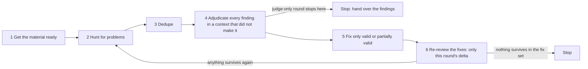

# Closed-loop adversarial review

**The one core discipline**: the context that finds a problem must never be the context that decides whether it is real.

## 1. When to use it

Don't look at what kind of object it is. Look at whether it has these three traits. All three have to hold:

1. **You cannot tell whether it is right by looking at the object alone.** You have to hold it up against a standard before you know how well it was done.
2. **That standard can be settled before review starts.** It may already exist — a specification, a team convention, a higher-level document, a source of fact you can go and check. It may also not exist yet, as long as you settle it before you start, or the user hands it to you on the spot. What matters is that it is **settled before review begins**: change the standard halfway through and every verdict you already gave stops counting. (If you find the standard itself is ambiguous, ask about it once, per §9 — don't quietly rewrite it.) If you cannot settle it, this process turns into everyone arguing for their own opinion. Don't use it.
3. **Missing a real problem is far worse than reporting a false one.** Independent adjudication costs extra, and "missing one hurts more than a false alarm" is exactly what makes that cost worth paying. When the two costs are about equal, checking the thing yourself is enough. (If the user explicitly asks for an independent review, this trait counts as satisfied — they have already made that call for you.)

When all three hold, the object can be anything: a batch of changes, a proposal, a migration plan, an audit, a release checklist, a piece of research, a contract, a decision record that has already been signed off.

It also applies when the user says "review this carefully" or "re-review after fixing". That sentence on its own satisfies the third trait (they asked for it explicitly). But if the first two don't hold — the object's correctness is plain on its own, or you cannot settle the standard — leave it alone for now, and in the second case settle the standard with the user first.

## 2. Why it has to be a loop

These three numbers explain why the process is shaped the way it is, and why none of its steps can be skipped:

1. **Fixes introduce new problems of their own**: in measured runs, **16 of 51 fixes** introduced something new, or fixed one place and missed another — which is why, in a full round, every batch of fixes has to go back through review.
2. **Adjudication overturns a substantial share of findings**: roughly **1 in 5 to 1 in 3** findings ends up invalid, downgraded, or re-described because it was really a symptom of something larger. What this step saves is not time; it is a batch of pointless edits.
3. **It converges**: on a real project, the number of new problems each round found inside the previous round's fixes went **8 → 3 → 3 → 2 → 0**. The process is heavy, but it is not endless.

The worst defects are usually not the ones you find by walking a checklist. They are the ones an adjudicator pulls out by asking a question nobody else asked: "this edit — which path that should have changed alongside it did it miss?"

## 3. The shape of the loop



Every round after the first goes back to step 2, never to step 1.

### The two modes

**Full round** — steps 1 to 6, what the diagram draws. Use it when this process owns the fix, that is, when nothing else is going to act on the findings.

**Judge-only round** — steps 1 to 4, then stop. Nothing is fixed and there is no re-review inside the round. What the round produces is **the list of problems that survived adjudication**, and what happens to that list is somebody else's job. Use it when this round is a gate inside a larger process that owns the fix and the re-entry: that process fixes, then runs this round again on the new state, so convergence is measured across those rounds rather than inside one. The "0 valid + 0 partially valid + 0 subsumed" rule in §8 is not this mode's exit condition — producing the finding list is.

This is not the cheap mode. Steps 1 to 4 are the expensive part; what it drops is the half that was about to be done twice anyway.

## 4. Who runs this round

**Look up what the type you can dispatch is allowed to do** — its tool list, or whatever the harness shows you about it — **instead of assuming, and instead of inferring it from a general warning about nesting.** Then answer one question: **can you hand a task to a subagent that can hand out tasks of its own?**

- **It can** → give the whole round to one subagent and let it run the round as the orchestrator. It dispatches the finders and the adjudicator, and hands you back only the conclusions. This is what keeps every intermediate result out of your own context, which is the difference between this process being usable and unusable.
- **You can dispatch, but your subagents cannot dispatch further** → orchestrate the round yourself, but still hand out as much of the work as you can. What you must not do is read every part of the object yourself.
- **You cannot dispatch, but you can open a new session that has dispatch tools of its own** (non-interactive is fine) → that session works as the orchestrator and gets you the same separation.
- **Neither** → do it yourself in two passes. First pass: you hunt, and write every finding down in the §7 format. Then clear your context — start a new session, and come back carrying only the findings list, the object, and the standard. Second pass: you judge each finding against §8. In the report, say plainly that this round used the two-pass method and had no independent-context adjudication.

How much to split, how many to dispatch, which executor to use — you decide those from your own capability and the object in front of you. §6 and §7 set the bounds you decide inside.

What the orchestrator's task has to carry, and what its reply has to contain, are in §7.

### Preconditions

- You have settled the standard from trait 2 of §1.
- The object can be retrieved, can be stored, can be compared before and after a change, and can be rolled back if needed.

## 5. Get the material ready

The reviewers read the material itself, not your context, so before the round starts it has to exist at a path they can reach. If the object is already a file they can read, that is the path — there is nothing to make. Getting it ready takes three steps:

1. **Whatever the reviewers read has to live somewhere they can reach**: if the object is already a file inside the working tree, that is already true and this step is done. Only when it isn't — the object is a URL, a chat log, something in your own head — does it have to be written out: by default into a scratch directory inside the working tree (most harnesses only let subagents read inside the working tree, and a headless session usually has no permission prompt to click — if it can't read it, it can't read it). The dispatch prompt must give an **absolute path**. Under version control a scratch file will show up as untracked; keep it out of the way by adding it to the repository's local exclude file (get its path with `git rev-parse --git-path info/exclude`) — note that this is a persistent change to local configuration. With no version control, just put it somewhere nothing else reads. **Nothing here has to be preserved after the round** — the next round's delta comes from the fixes themselves (§8), not from a stored copy of the old state. The one thing that does outlive the round is **the round's own record**, and that is a different kind of object: see §8.
2. **Prepare what the material contains**: if there is a delta, give the delta (with version control, use the kind that includes staged changes; for newly added files run `git add -N` first — a bare `git diff` shows neither staged changes nor new files; if you cannot produce a delta, give full copies of those files instead). If there is no delta, give full copies.
3. **Record what you intend to change this round**, so §10 can check it at closing. With version control, `git status --porcelain` lists it. Without it, hash every file before you start and again after you finish; comparing the two tells you what actually moved. Check that against your plan and confirm you touched nothing outside it. If you can do neither, write clearly in the report that "this part rests on self-report plus manual checking" — do not write it as though you had confirmed it.

Alongside that, write these three things out **item by item**, and put them into **every finder's task verbatim**:

1. **What the object is**: what this material is, and the author's own account of why it was done this way — mark that second half as **the author's account, not part of the standard**. A reason carried inside the object is the object grading itself; the finders have to know what it is, not to be handed its defence.
2. **The acceptance criteria**: write down what this review is judging against. If it is an existing specification, convention, or higher-level document, name which one. If it was settled on the spot, write the text of those criteria here.
3. **What this round does not do** (required; write "none" if there is nothing on it; the common categories are below — add or drop them to suit the object). **Without this list, reviewers will report the things you deliberately left alone as defects** — that is the number one source of noise, and it buries the real findings:
   - Scope or level of detail already declared out of bounds: not doing X / Y / Z this round — must not be reported as an omission; the only reportable thing here is whether the consequences of not doing it were spelled out.
   - Implementation details deliberately left unwritten — must not be reported as defects.
   - Alternatives that were considered and rejected (the counter-argument for them) — these are not leftovers.
   - Existing terminology carried over — this is not a wording problem.
   - Items already adjudicated and settled in a previous round — only "not actually fixed / fixed in the wrong direction / introduced a new problem" counts as a finding this round.

## 6. How much to split, and when not to bother at all

**Use as few parallel subagents as you can. One subagent should finish one piece of work on its own** — one hunt is one subagent, one round of adjudication is one adjudicator. Every extra subagent carries a fixed overhead that has nothing to do with the task (system prompt, tool definitions, skill list), and you pay it again on every round.

**Settle this before you dispatch, not in §11's closing check**: **is one adjudicator going to judge the whole list?** Send it to two only when the list is more than one context can read — never because it has a lot of rows on it, and never to go faster. Two adjudicators over one list each pay that fixed overhead, neither can mark a finding as the symptom of one sitting in the other half, and you merge two sets of verdicts by hand. §11 confirms this was settled; it is not where it gets decided.

Split only when the object is genuinely too large for one context to hold — on the order of a few dozen files, or a few hundred changed lines. When you do split, split as little as you can, keep the pieces non-overlapping, and make the pieces together cover everything. When there is more than one piece, one of them has to be the one that goes after what the others missed — see §7.

**If the object is far beyond that — hundreds of files, or thousands of changed lines — say so and stop.** The right answer to "this change is too big to review" is to ask the user to bring it back in several passes, not to fan the review out across a dozen subagents. A review that big produces a finding list nobody can act on.

And do not start at maximum process: when the object has only one or two reviewable sides, or right and wrong are plain at a glance, checking it yourself is enough. Two things override that:

- **An explicit request from the user.** It settles trait 3 of §1 on its own, so run the process whenever traits 1 and 2 hold.
- **The cost of a miss being irreversible, or the result touching an external commitment.** Then run the full process, no matter how few pieces the object cuts into.

## 7. What every dispatched task has to carry

The rules in this section **hold for any multi-subagent task, not just review** (parallel research, bulk checking, and so on).

When you dispatch more than one task at the same level, **send them all at once** rather than one after another; things only need to be serial when what the next step looks like depends on how this one came back. When you do split, the pieces must not overlap and must together cover everything, and **exactly one of them is the one that goes after what the others missed** — whether references still resolve, whether anything should have moved with a change and didn't, and claims like "this has no impact". Whether to split at all is §6's question.

**Every dispatched task has to carry these**:

1. A `<critical>`-level hard constraint: **read-only** — don't modify the object, don't commit, don't run the full test suite or lint. Apart from writing its own artifact into the scratch directory you designate (see §5) — **name that path in the task, so it does not have to guess** — it must not touch any other file in the working tree.
2. What the object is + the acceptance criteria (spelling out what it is being judged against) + what this round does not do.
3. Every finding has to give: an identifier / **location** (where it sits in the object — line number, section number, item number, whichever suits the object) / **verbatim excerpt** / why this is a problem / **severity** / **minimal fix** / confidence — and, when the standard itself mandates the thing the finding holds against, a **`mandated by the standard`** mark. No empty phrases like "consider improving consistency".
4. A fixed-format table: `# | Location | Severity | Excerpt | Problem | Minimal fix | Confidence` (severity means **how big the impact is**; name the three tiers yourself to suit the object, for example "must fix / should fix / optional" — when the object is a release artifact, the top tier is "blocks release"; **say which of your tiers may be deferred rather than fixed — §8 does not let you decide that later**). This is a different thing from the four verdict tiers in §8; don't mix them up. **"No problems at all" is an allowed conclusion.** Follow the table with two more sections:
   - **"Items that could not be judged"** — anything you could not settle, with what would settle it. An empty section is a result, not a failure.
   - **"Set aside deliberately"** — anything you placed in scope and then chose not to report, one line each with the reason, and the same section when the round ran out of room to look at it. Write "none" rather than leaving it blank: **from the outside, a silent drop and an empty area look identical**, and only one of them is a judgement somebody has to own.

### When the whole round goes to one orchestrator

If §4 put a subagent in charge of the round, its task carries everything above, plus the three things from §5 written out verbatim — what the object is, the acceptance criteria, and what this round does not do. Tell it to get the material ready per §5 and to decide how much to split per §6. **Do not step it down below those bounds**; it decides inside them, and it decides from its own capability and the object.

Its reply contains conclusions only:

1. A one-sentence conclusion, and how many verdicts of each kind (valid / partially valid / invalid / subsumed).
2. The findings table: `# | location | verdict | one sentence stating the problem | minimal fix`.
3. Items that need the user to decide, written out per §9 — "none" if there are none.
4. How many it dispatched in total, and a confirmation that no adjudicator is a finder.
5. For every item in the finding list: the adjudication evidence, and the artifact path, so it can be read back on demand.

Not allowed: pasting back the raw output, tables, or report body of its own dispatches; pasting the full text of the object; modifying anything without authorization.

**The reply must carry concrete fixes.** Once the round is handed out, you no longer have a direct feel for whether a finding is exaggerated — a concrete `old→new` lets you see it at a glance without re-gathering the evidence.

**Review only, unless you grant write access.** If the orchestrator is allowed to fix as well, it must work **serially**: while it holds the working tree, you must not edit the same files.

**For a re-review, dispatch a fresh orchestrator.** A newly opened one has a clean context and is more reliable than the one that just ran.

**Whoever you dispatch may have no shell tool.** When a task needs to see a diff or command output, whoever dispatches it runs the command first and sends the raw text along with the task.

**While the dispatches are out.** Do not poll with a short timeout, and do not sit in one silent open-ended wait either. If you have local work — the round's record (§8), the next round's material, reading what has already come back — do it; results arrive on their own. When you are genuinely idle, wait in bounded stretches where your harness allows it, and between stretches list what is still out. **A seat that finished without reporting is one you paid for and did not get** — worth chasing now, not at closing. Chase the ones that are done, not the ones that are slow.

## 8. Dedupe · independent adjudication · fix only what survived · re-review the fixes · when to stop

### Dedupe

When the same place is hit **independently** by two or more finders, that is a sign of higher confidence: merge them into one finding and say so when it goes to adjudication. **Findings in different places whose fix is fully covered by another finding get merged here too** (keep only the broader one, and note that the other is covered by it) — don't leave it until the fixing step and edit the same thing twice.

### Independent adjudication (the one judging must not be the one who found it)

- **The adjudicator must never be the one who found it.** If the same finding goes through adjudication again in a later round, it also cannot reuse its earlier adjudicator — this has no exceptions. **One adjudicator judging many findings is the normal shape**, not something to avoid: split the list only when it is genuinely too large for one context to hold (§6). **If you do split it, the report says so and says why** — and the reason has to be how much the list is to read, not how many rows are on it. When you cannot dispatch anyone, use the two-pass method in §4.

**A context judging several findings in a row is anchored by the finding before**, so fence each of them off:

1. **Every finding gets its own verdict**, with its own evidence, re-description, minimal fix and counter-evidence. **"Same as above" and "this whole category looks fine" are not allowed.**
2. The task must say explicitly: **do not let the other findings influence the one you are judging.** Finish every verdict first, then write the summary — never the other way round.
3. **Do not put two findings about the same place side by side** (dedupe those first), and **order or shuffle the list** so that same-category, same-conclusion items are not adjacent — adjacency invites copying one answer down the list.
4. **Being one of many is never a reason to lower the bar.** Every finding carries exactly the same evidentiary requirements it would carry if it were judged alone.

- You have to pass on **the original finding's text and the argument it came with** in full — **saying only "please confirm whether this is right" invites agreement**. The task must also say explicitly: "don't assume it holds, go and look, go and check"; "if it doesn't stand up, call it invalid and give counter-evidence — don't just agree"; "if part of it holds, call it partially valid and draw the line between what holds and what doesn't".

**The adjudicator must hand back exactly these five things** (none of them can be missing, and a bare conclusion is not enough):

| What | Content |
|---|---|
| Verdict | Valid / partially valid / invalid / subsumed — these four tiers only |
| Evidence | What you looked up yourself: **location** + verbatim excerpt + **how to reproduce the check you made** (if it was a command, give the command so someone else can re-run it; if it was a reading comparison, give both locations and both texts) |
| Re-description | Only when the verdict is "partially valid" or "subsumed". **Partially valid**: rewrite the finding so that what is left is fully valid — cut it down to the part that holds, and drop the part that was overstated or misdiagnosed. **Subsumed**: name the larger problem this is a symptom of, with a location for it. Either way, **the rewrite is the finding from here on** — the original text is not what gets acted on. |
| Minimal fix | A version someone can edit straight in (for a replacement, write `old→new`; for an insertion, a deletion, or something a human has to decide, say where it goes, what comes out, and what the content is) + whatever else has to change along with it |
| Counter-evidence | Only when the verdict is "invalid": **location** + verbatim excerpt |

The counter-evidence is what earns an "invalid" verdict, and the adjudicator does that work either way. It is **not** carried into the finding list — nothing gets acted on for an invalid finding, so nothing needs saying about it.

**What is in the finding list.** This is the output a reader sees, and it is the same shape whether the round was full or judge-only:

- **valid** → the finding as the finder wrote it.
- **partially valid** → the re-description, not the original.
- **subsumed** → the root problem, not the symptom.
- **invalid** → nothing at all.

So the list is problems that hold, each already cut down to the part that stands up. Every line in it can be acted on without re-litigating anything.

A finding marked **`mandated by the standard`** is on the list but not in the fix set: acting on it would contradict the standard, and the author of the standard does not grade their own work. Record it for whoever reads the report, say what it collides with, and leave the choice to them. This is the one case where a finding that survived adjudication is not fixed — and it still gets said out loud, never dropped.

### Fix only what survived

- **Fix everything that appears in the finding list.** For a "partially valid" finding, follow the rewrite the adjudicator gave — do not fix the inflated version from the original finding. For a "subsumed" one, fix the root problem, not the symptom. Multiple edits in the same file are made one after another in order (they cannot be parallel); different files can be edited at the same time. Prefer the ready-made fix the adjudicator supplied.
- **Except the tier the object declared deferrable** (§7 item 4). A finding in that tier that survived adjudication is **deferred, not dropped**: it goes into the report as a carry-over item, with its location and the fix that was ready, and the reader decides. Deferral is never a way to close a round early, and never silent — what you defer, you list.
- **Do not fix "invalid" findings.** They are not in the finding list either, so there is nothing to say about them beyond the adjudication record.
- **If the same fix keeps failing, change who makes it.** Twice through the loop on the same finding means the context making the fix cannot see its own problem: send the next pass to a fresh one, carrying the finding and a plain statement of what was already tried. Only after repetition — the context that knows what it chose and why is worth keeping until it has demonstrably stopped working.
- **Pre-existing errors**: if one happens to sit in a place you are editing, fix it while you are there; if it doesn't, log it as a carry-over item — **don't let it pass silently**. **Do not widen the scope while fixing** (rewriting the parser on the side, adding a mechanism on the side) — suggestions that widen scope like this often get overturned in adjudication.

### Re-review the fixes, and when you may stop

**A re-review comes back with three things.** A **verdict per fix it was sent** — landed or not landed, with a location; "I tried" is not landed, the defect has to be gone. **What the fix itself broke**, with a location — that joins the open findings. And **what it noticed outside the delta**, reported, marked non-blocking, and carried into the report rather than acted on. That third channel is there so that staying inside the delta does not require staying silent.

**The round's record.** Keep it as the rounds run, not assembled at the end: one line per round — which round, how many findings, the verdict spread, how many fixes landed, what is still open — in a file you name and keep until the object is done. Its first line says which object it belongs to, because **an unlabelled record is worse than none**: a later round cannot tell whether it is reading its own history or someone else's. It holds verdicts and the edits you made, and **never a snapshot of the object to compare against** — that is what §5 rules out. If your context is lost, this is where you resume from, and the object still has to be read again.

Send **everything fixed this round** to review as a new batch: **send only this round's delta, never the whole object**. Build that delta **out of what you changed, not out of a stored copy of the old state** — you already hold it in a better form than a diff: every fix in the list arrived as a ready-made `old→new` from adjudication, together with what had to move alongside it. Hand the re-reviewer exactly those, each with the location it landed at and a note for the ones that were insertions or deletions rather than replacements. Where version control is in use you may produce a diff as well (`git diff <baseline>` compares the working tree, covering committed, staged, and unstaged parts; run `git add -N` for new files first, see §5 item 2). Either way, make sure the adjudicator can see the delta. Every other step is exactly as before.

**In a full round you may stop when a re-review round comes back with "0 valid", "0 partially valid" and "0 subsumed"** (anything judged "partially valid" has to be fixed using its rewrite, and anything judged "subsumed" has to be fixed at the root, before it counts as done) — **counted over the set this round set out to fix**; anything deferred or `mandated by the standard` is carried, and does not hold the round open. A judge-only round has no such test — see §3.

**A round that is not getting smaller is a different problem from a round that is slow.** Before you buy another round, look at what this round's findings have in common. If they are about what the last round's fixes touched, or the same defect keeps coming back under a new name, the loop is not converging: the object has a structural problem that more rounds will not reach. Two rounds at the same size settle nothing either way — a healthy loop can hold flat for a round before it falls. When you judge it structural, stop dispatching and hand over the round's history, or go back to §1 trait 2 and ask whether the standard could be settled at all. **Do not settle it yourself**: whoever ran the round is not the context that judges it.

**Do not** substitute "the tests pass" or "the grep returns nothing" for this step — that is one check at closing time, and it is not an adversarial review. An adjudication **can overturn a previous round's verdict** (when new evidence turns up); **the new evidence wins**, and the report has to say plainly what was overturned.

## 9. Questions that need the user to decide

Reviews always turn up questions where "there isn't enough evidence, and both approaches sound reasonable". Ultimately a human has to settle these — but **asking a human spends their attention, so you first have to prove that this really is something only a human can settle**. The default is "work it out myself, then act on the basis I found" — not "go ask the user".

**Before asking, three steps have to be finished**: ① **everything that can be checked has been checked** (anything you could settle by reading a file, looking something up, running it once, or digging through history — you are not allowed to ask); ② **look for an existing basis first** (a specification, a higher-level document, a precedent for the same kind of question — if the answer is already settled, follow it and say in the report where the basis is, and don't ask); ③ **dispatch one agent to check independently and confirm that it really cannot be settled** (if the checker can produce a basis, act on that basis). When you cannot dispatch anyone, use the second pass of the two-pass method for this step, and say plainly that it is not an independent-context check.

**All four of these have to hold before something can go to a human**: ① everything checkable genuinely has been checked; ② there genuinely is **no** basis to cite in the specifications and precedents (you listed them one by one and none apply — not that you didn't go looking); ③ the options genuinely **lead to different outcomes** (it changes behaviour, a contract, an external commitment, or whether you can back out — wording, formatting, and naming preferences don't count); ④ the outcome is **irreversible, or reaches beyond the scope of this change**. If only the first two hold, that is a "can't settle it yet, but can proceed on convention" — write the basis and the impact in the report and move on.

**When you do hand something to a human, give it enough information**: ask everything at once, don't ask one question at a time. Each item carries six things — **the question** (one sentence, specific enough to point at a location or a behaviour), **what you already checked** (what you looked at and what came back), **the options** (2–3, each with its consequences and costs spelled out), **your recommendation** (which one and why), **the default** (which way this round proceeds if the user doesn't answer), **how to answer** (something the user can reply to in a sentence, like "go with A" — not an essay question).

**Don't stop just because there is something to ask**: fix everything else that survived and run the re-review as usual, keep a note of the items that need a decision, and hand them over together at the end. If a decision item is blocking later work, write it explicitly as "blocked here + what it blocks".

## 10. Closing out and reporting

There is one rule: **for every place that went through adjudication and has now been fixed, redo the check that first established it, and paste the raw output; then list everything this round touched and confirm that only the expected things were touched.** How you redo it depends on how it was first decided: if it was decided by running a command, re-run the command and paste the output — commands of the same kind can be combined into one script and run together in one go; if it was decided by comparing what you read (for example "these two contradict each other"), put those two locations and texts side by side again. Anything you claim — "this has no impact", "everything is covered" — has to come with evidence. Saying it is not enough.

Example (the only one here; replace the whole block with whatever suits your own object — **if any command in it fails, or the pattern is not valid, that must never be printed as a zero-hit result**):

```bash
grep -rnE "<pattern-1>|<pattern-2>" <object-dir> | grep -vE "<allowed-exceptions>"; st=("${PIPESTATUS[@]}")
rc="${st[0]}"; [ "${st[1]:-0}" -ge 2 ] && rc="${st[1]}"
if [ "$rc" -eq 1 ]; then echo "(zero hits)"; elif [ "$rc" -ge 2 ]; then echo "(check command failed rc=$rc — not a zero-hit result)" >&2; exit "$rc"; fi
```

**How long a reply may be**: any dispatched executor's reply is capped at 20 lines of **body text**. (Not counted against the 20: one line per row of the findings table; the full block for each adjudicated finding — verdict / evidence / re-description / minimal fix (including multi-line `old→new`) — give all of them if there are many; items needing a user decision written out in full per the six parts of §9, with no limit on how many and all asked at once; the raw output of the closing check, which goes only in the final report.) What you are compressing is the concluding prose, not the things that have to come back. If the body genuinely cannot be compressed, write the process to disk and return only the conclusion and the path. **The report has to contain**: how many findings there were in total and how the verdicts break down; a row-by-row list `# | Finding | Verdict | Disposition` for what survived — invalid findings are counted in the verdict spread, not listed; if there were several rounds, a per-round summary `Round | Pieces | After dedupe | Adjudications | Verdict spread | Fixes` — where a round used more than one adjudicator, the row carries the reason it was split (§8); the convergence path plus the final closing evidence; the raw output of the closing check; and carry-over items and items awaiting a user decision, written out per the six parts of §9 — **and, separately, the decisions you took on the reader's behalf, in the order you took them, each with what it would have cost if it were wrong**. A decision that never leaves your own context was a decision made in secret: it is the only place the reader learns what you settled for them.

## 11. Self-check before handing off, and pitfalls already hit

**Check each of these before you finish** (each one has to point at concrete evidence):

- Does the dispatched task carry the "read-only" hard constraint? Does it carry what this round does not do?
- Has every finding been adjudicated? Was the adjudicator someone other than the one who found it?
- Did you use as few subagents as you could (§6)? **Was §6's adjudication question settled before you dispatched** — one adjudicator judging the whole list, not one dispatch per finding — and if it was split, does the report carry the reason?
- Is there a **round record** (§8) — written as the rounds ran, not assembled at the end — and does its first line say which object it belongs to? Is it free of any snapshot of the object?
- Does every finder's reply carry **"set aside deliberately"** with "none" written out rather than left blank, and did you rule on each line that was there?
- Was every finding judged on its own evidence — no "same as above", and the summary written only after every verdict?
- Did each adjudicator hand back all five things (§8)? Did every "invalid" come with a location and counter-evidence, and every "partially valid" and every "subsumed" with a rewrite? **Is the finding list carrying only what survived** — no invalid finding, no counter-evidence?
- **Full rounds**: is there a record of the fix-and-re-review rounds? In the round you stopped at, were "valid", "partially valid" and "subsumed" all 0 **for the set that round set out to fix**? Is everything deferred, and everything marked `mandated by the standard`, carried into the report with its location rather than left out? Did you paste **raw command output** at closing, rather than a line saying "checked and passed"?
- **Judge-only rounds**: did the round stop after adjudication — nothing fixed, nothing re-reviewed — and was the finding list handed over intact?
- If an orchestrator ran it, was its reply conclusions only? Does the findings table carry concrete fixes? Did it leave every file alone when it wasn't authorized to edit?
- Do the items handed to the user carry "what was checked + the consequences of each option + my recommendation"? When nobody could be dispatched, does the report say plainly that "the two-pass method was used, with no independent-context adjudication"?

**Pitfalls already hit**: running the whole process yourself as the lead agent drowns your context in N subagents' output (which is why it defaults to an orchestrator);
putting a role that is not allowed to dispatch in charge of orchestrating means it can't dispatch anyone, and the round comes back to you; **one level of nesting is not the same failure** — a subagent that hands the round to a subagent that dispatches the finders and the adjudicator is §4's first branch and works wherever the harness grants dispatch rights. What fails is going **one level deeper than that** (a subagent that dispatches subagents that dispatch subagents again) — check the depth your harness allows before you rely on it, and never conclude from this warning that nesting is broken in general; judging several findings in one context without fencing each one off lets the earlier verdicts drag the later ones (§8); writing only "fixed" in the report without saying why it was judged that way means the same question comes back next time. The three commonest ways to miss an edit are: **the same phrasing changed in N−1 places** (go through every place it appears, including elided forms and variants — don't search literally), **the same concept drifting under several names** (settle on what most people at that level write, or on the project's existing authoritative source), and **peripheral files left out** (scripts, fallback manuals, and tables of counter-examples sit outside the main edit area and have to be listed separately and changed along with everything else).


